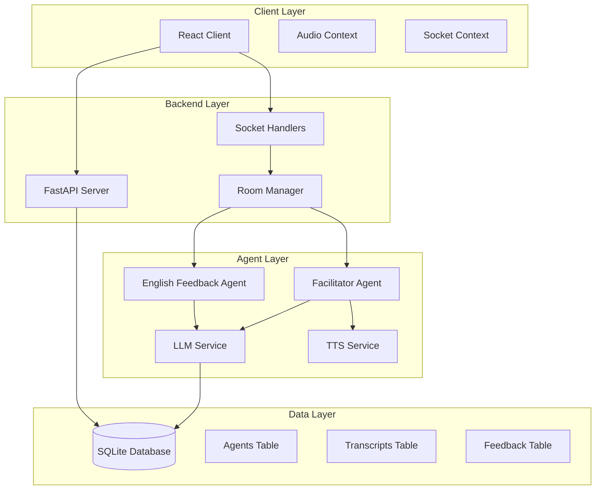

# AI Agent Integration Design Document

## Overview

This design document outlines the integration of conversational AI agents into the GupShup Cafe platform. The system will incorporate two types of agents: a Facilitator Agent that provides vocal guidance during conversations using TTS, and an English Feedback Agent that delivers real-time, private feedback to participants on their spoken English. Both agents will be seamlessly integrated as virtual participants in the existing turn-based conversation system.

## Architecture

### High-Level System Design

The AI agent integration leverages the existing FastAPI backend (`server_py/`) and React frontend (`client/`) architecture. Agents are registered as special participants in rooms and interact through the established Socket.io communication patterns and REST API endpoints.



### Agent Registration Architecture

Agents are automatically registered when rooms are created, appearing as special participants with distinct roles. This design decision ensures agents integrate seamlessly with existing participant management logic while maintaining clear separation of concerns.

## Components and Interfaces

### 1. Agent Management Service

**Location**: `server_py/src/agents/`

**Core Components**:
- `AgentCore`: Base class for all agent implementations
- `DebateFacilitatorAgent`: Handles conversation facilitation with TTS output
- `EnglishFeedbackAgent`: Provides real-time English language feedback
- `MCPToolsManager`: Manages Model Context Protocol tool integrations

**Key Interfaces**:
```python
class AgentCore:
    def __init__(self, room_id: str, agent_type: str, llm_service: LLMService)
    async def process_transcript(self, transcript: TranscriptModel) -> Optional[str]
    async def generate_response(self, context: Dict) -> str
    def get_system_prompt(self) -> str

class DebateFacilitatorAgent(AgentCore):
    async def prepare_turn_response(self, room_context: RoomContext) -> AudioResponse
    async def synthesize_speech(self, text: str) -> bytes

class EnglishFeedbackAgent(AgentCore):
    async def analyze_speech(self, transcript: TranscriptModel) -> FeedbackModel
    async def generate_private_feedback(self, participant_id: str, feedback: str) -> None
```

### 2. LLM Integration Layer

**Location**: `server_py/src/llm/`

**Components**:
- `LLMInterface`: Abstract base for LLM providers
- `GeminiLLM`: Google Gemini integration
- `BedrockLLM`: AWS Bedrock integration
- `AIServiceManager`: Orchestrates LLM service selection and failover

**Design Rationale**: Multiple LLM provider support ensures system resilience and allows for model-specific optimizations (e.g., Gemini for conversational flow, Bedrock for grammar analysis).

### 3. Enhanced Socket Event System

**New Events**:
- `agents_joined`: Broadcast when agents are registered to a room
- `private_feedback`: Private message delivery for English feedback
- `facilitator_turn`: Broadcast facilitator audio and transcript
- `agent_processing`: Status updates during agent computation

**Modified Events**:
- `participants_update`: Extended to include agent participants
- `new_turn`: Enhanced to handle agent turn scheduling

### 4. Turn Management Enhancement

**Location**: `server_py/src/socket/timer_manager.py`

**Key Features**:
- Pre-computation scheduling for facilitator responses (15-second lead time)
- Asynchronous feedback processing pipeline
- Agent turn integration with existing participant rotation

**Design Decision**: The 15-second pre-computation window allows for TTS generation without blocking the conversation flow, maintaining the real-time experience.

## Data Models

### Enhanced Database Schema

#### New `agents` Table
```sql
CREATE TABLE agents (
    agent_id TEXT PRIMARY KEY,
    room_id TEXT NOT NULL,
    agent_model TEXT NOT NULL, -- 'gemini-1.5-pro', 'bedrock-claude-v2'
    agent_type TEXT NOT NULL CHECK(agent_type IN ('facilitator', 'english_feedback')),
    status TEXT DEFAULT 'active' CHECK(status IN ('active', 'inactive', 'processing')),
    system_prompt TEXT,
    total_interactions INTEGER DEFAULT 0,
    created_at DATETIME DEFAULT CURRENT_TIMESTAMP NOT NULL,
    FOREIGN KEY (room_id) REFERENCES rooms (room_id)
);
```

#### Enhanced `transcripts` Table
```sql
-- Add participant_id to link transcripts to agents or human participants
ALTER TABLE transcripts ADD COLUMN is_agent_generated BOOLEAN DEFAULT FALSE;
```

#### Enhanced `feedback` Table
```sql
-- Add agent tracking and transcript linking
ALTER TABLE feedback ADD COLUMN agent_id TEXT;
ALTER TABLE feedback ADD COLUMN transcript_id TEXT;
ALTER TABLE feedback ADD COLUMN feedback_type TEXT DEFAULT 'english_improvement';
ALTER TABLE feedback ADD FOREIGN KEY (agent_id) REFERENCES agents (agent_id);
ALTER TABLE feedback ADD FOREIGN KEY (transcript_id) REFERENCES transcripts (transcript_id);
```

### Pydantic Models

**Location**: `server_py/src/models/`

```python
# --- Enums for the Agent Model ---

class AgentStatus(str, Enum):
    """Represents the operational status of an agent instance."""
    ACTIVE = "active"
    INACTIVE = "inactive"
    ERROR = "error"

class AgentType(str, Enum):
    """Defines the role of the agent in a room."""
    FACILITATOR = "facilitator"
    ENGLISH = "english_feedback_provider"

class AgentModelSource(str, Enum):
    """Specifies the underlying LLM service."""
    GEMINI_FLASH = "gemini-2.5-flash"
    BEDROCK_CLAUDE_3 = "bedrock-claude-3"
    # Add other models as needed

class AgentModel(BaseModel):
    agent_id: str
    room_id: str
    agent_model: str
    agent_type: Literal['facilitator', 'english_feedback']
    status: Literal['active', 'inactive', 'processing']
    system_prompt: Optional[str]
    total_interactions: int = 0

class AgentResponseModel(BaseModel):
    agent_id: str
    response_text: str
    audio_url: Optional[str] = None
    processing_time: float
    confidence_score: Optional[float] = None
```

## Error Handling

### Agent Failure Recovery

1. **LLM Service Failures**: Clear error messages in such cases.
2. **TTS Service Failures**: Graceful degradation to text-only facilitator responses using the Live Transcript component on the client.

### Client-Side Error Handling

1. **Audio Playback Failures**: Fallback to text display for facilitator responses
2. **Socket Disconnections**: Automatic reconnection with agent state synchronization
3. **Feedback Delivery Failures**: Retry mechanism with exponential backoff

## Testing Strategy

### Unit Testing

**Location**: `server_py/tests/`

- **Agent Core Logic**: Test individual agent response generation
- **LLM Integration**: Mock LLM services for consistent testing
- **Database Operations**: Test agent CRUD operations and schema migrations
- **Socket Event Handling**: Test agent-specific event processing


### Client-Side Testing

**Location**: `client/src/tests/`

- **Agent Participant Display**: Test agent rendering in participant lists
- **Audio Playback**: Test facilitator audio integration
- **Feedback UI**: Test private feedback message display
- **Socket Event Handling**: Test client-side agent event processing

## Security Considerations

### Agent Authentication

- Agents use system-generated credentials with room-specific scope
- Agent actions are logged and auditable through the existing participant tracking system


### Asynchronous Processing

- **Feedback Generation**: Processed asynchronously to avoid blocking turn progression
- **Audio Synthesis**: Pre-generated during facilitator preparation window
- **Database Writes**: Batched for improved performance during high activity


This design ensures seamless integration of AI agents while maintaining the existing system's performance and user experience standards.